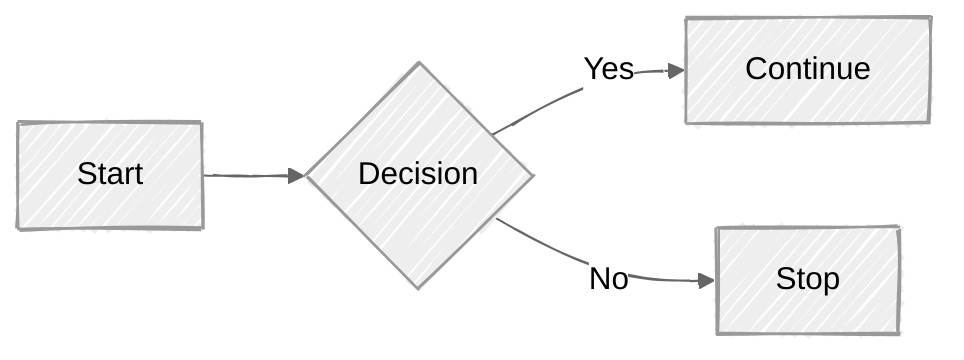
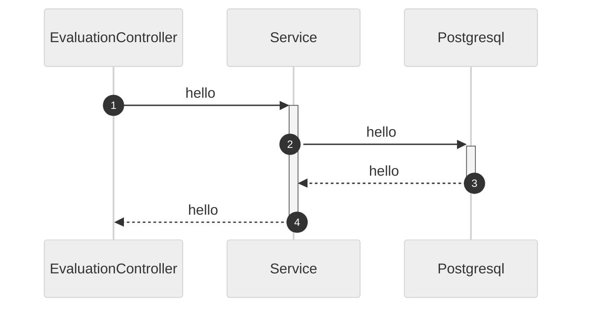
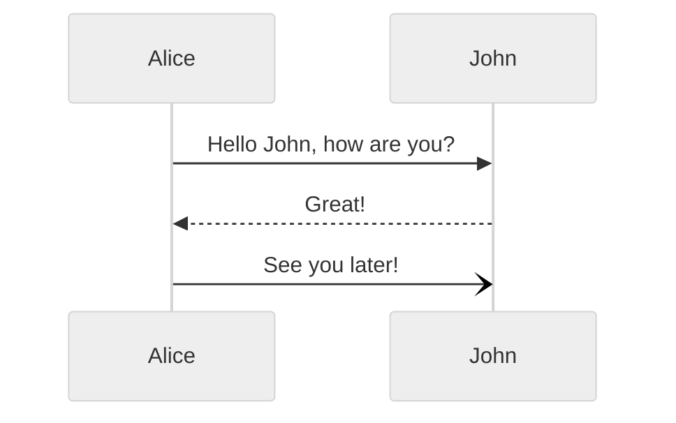
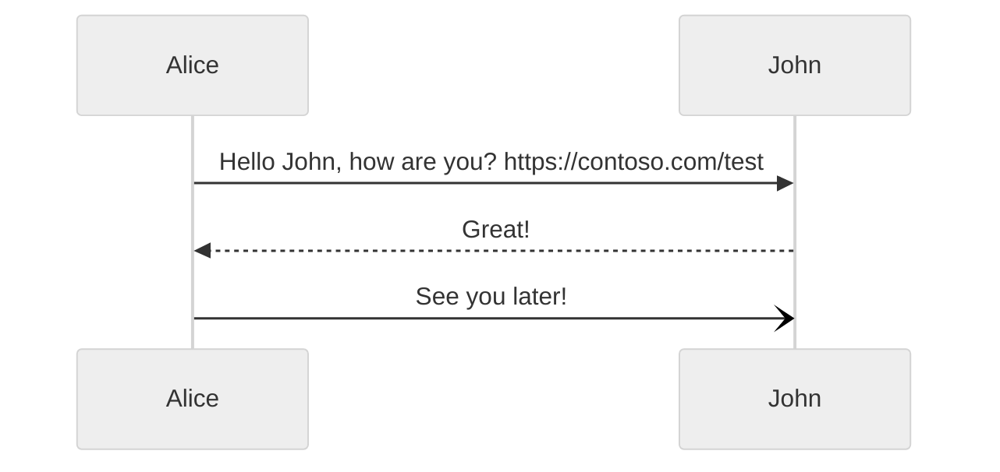
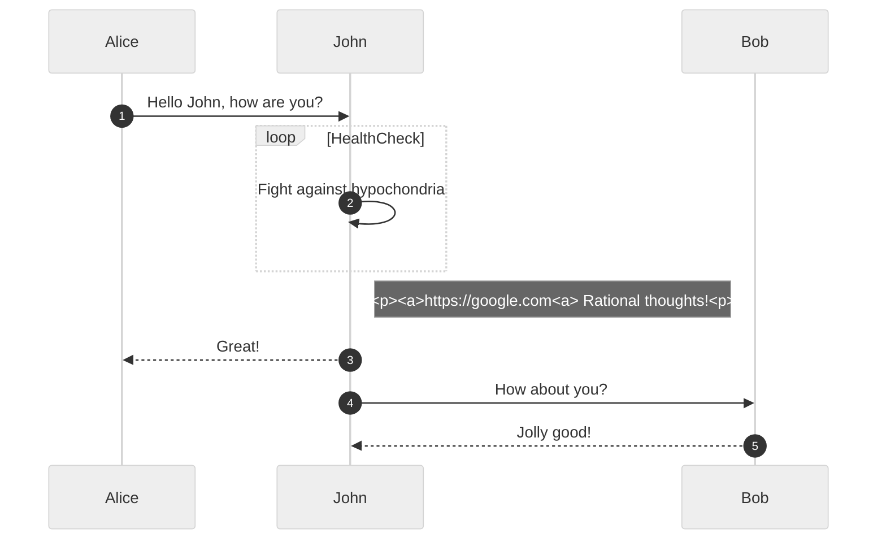
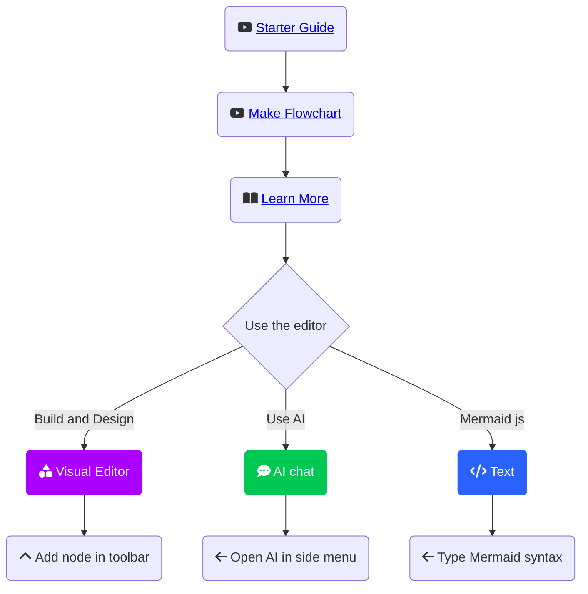

```mermaid
info
```

```mermaid
---
config:
  look: handDrawn
  theme: neutral
---
flowchart LR
  A[Start] --> B{Decision}
  B -->|Yes| C[Continue]
  B -->|No| D[Stop]
```

```mermaid
---
config:
  look: handDrawn
  theme: neutral
---

sequenceDiagram
    autonumber
    EvaluationController->>+Service: hello
    Service->>+Postgresql: hello
    Postgresql-->>-Service: hello
    Service-->>-EvaluationController: hello
```

```mermaid
---
config:
  look: handDrawn
  theme: neutral
---

sequenceDiagram
    participant Alice
    participant John
    link Alice: Dashboard @ https://dashboard.contoso.com/alice
    link Alice: Wiki @ https://wiki.contoso.com/alice
    link John: Dashboard @ https://dashboard.contoso.com/john
    link John: Wiki @ https://wiki.contoso.com/john
    Alice->>John: Hello John, how are you?
    John-->>Alice: Great!
    Alice-)John: See you later!
```

```mermaid
---
config:
  look: handDrawn
  theme: neutral
---

sequenceDiagram
    participant Alice
    participant John
    links Alice: {"Dashboard": "https://dashboard.contoso.com/alice", "Wiki": "https://wiki.contoso.com/alice"}
    links John: {"Dashboard": "https://dashboard.contoso.com/john", "Wiki": "https://wiki.contoso.com/john"}
    Alice->>John: Hello John, how are you? https://contoso.com/test
    John-->>Alice: Great!
    Alice-)John: See you later!

```

```mermaid
---
config:
  look: handDrawn
  theme: neutral
---

sequenceDiagram
    autonumber
    Alice->>John: Hello John, how are you?
    loop HealthCheck
        John->>John: Fight against hypochondria
    end
    Note right of John: <p><a>https://google.com<a> Rational thoughts!<p>
    John-->>Alice: Great!
    John->>Bob: How about you?
    Bob-->>John: Jolly good!
```

```mermaid
flowchart TD
%% Nodes
    A("fab:fa-youtube <a rel="noopener" href="https://www.youtube.com/watch?v=T5Zthq-QR2A&amp" target="_blank">Starter Guide</a>")
    B("fab:fa-youtube <a rel="noopener" href="https://www.youtube.com/watch?v=rfQ_yGJ8QAQ&amp" target="_blank">Make Flowchart</a>")
    C("fa:fa-book-open <a rel="noopener" href="https://mermaid.js.org/syntax/flowchart.html" target="_blank">Learn More</a>")
    D{"Use the editor"}
    E(fa:fa-shapes Visual Editor)
    F("fa:fa-chevron-up Add node in toolbar")
    G("fa:fa-comment-dots AI chat")
    H("fa:fa-arrow-left Open AI in side menu")
    I("fa:fa-code Text")
    J(fa:fa-arrow-left Type Mermaid syntax)

%% Edge connections between nodes
    A --> B --> C --> D -- Build and Design --> E --> F
    D -- Use AI --> G --> H
    D -- Mermaid js --> I --> J

%% Individual node styling. Try the visual editor toolbar for easier styling!
    style E color:#FFFFFF, fill:#AA00FF, stroke:#AA00FF
    style G color:#FFFFFF, stroke:#00C853, fill:#00C853
    style I color:#FFFFFF, stroke:#2962FF, fill:#2962FF

%% You can add notes with two "%" signs in a row!
```
